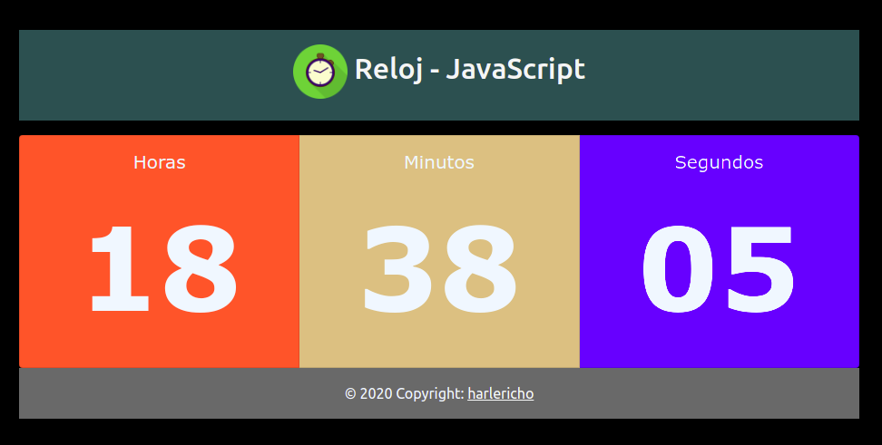

# RELOJ JAVASCRIPT
## Creación de un reloj usando javascript - html - css 

# Detalle del programa.
- Es un programa donde mostramos la hora - minuto - segundo del sistema.
# Vista.

## _Realizado por:_

# Github: @harlericho

> The MIT License (MIT)

### Este programa o sistema puede ser tomado como guia o enseñanza para sus futuros  proyectos.
> Copyright (c) 2021 harlericho

